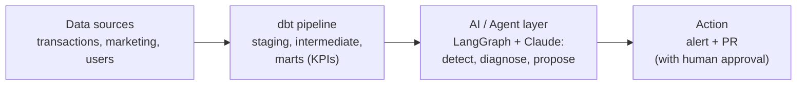
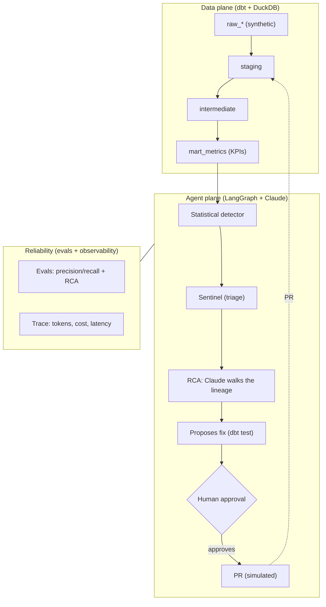

# Data Sentinel, Agentic Data Analytics Engineering

[Português](README.md) · **English**

Picture this: 3 a.m. on a Saturday, and a campaign's ROAS falls off a cliff. Someone has to notice, figure out why, and propose the fix before it turns into lost money or reaches the customer. This project puts AI agents on that night shift over the data layer: they watch the KPIs, find the root cause by walking the dbt lineage, and show up with the fix already in hand. The final call always belongs to a person.

In one line: **data monitoring run by agents (LangGraph + Claude), with engineering rigor and a production mindset.**

## Business value

A wrong KPI leads to a wrong decision. The point of this sentinel is to shrink the time between the problem happening and someone knowing about it: going from hours (or from the dashboard nobody opened) to minutes, the well-known MTTD, mean time to detection. And it does not just warn: it already hands over the likely cause and the dbt test that prevents a recurrence, leaving the decision to apply it to a person. In an operation with many KPIs, that is the difference between firefighting and preventing.

## Architecture at a glance



<p align="center">
  
</p>

> *A real `make pipeline` run (offline, deterministic mode): the agent finds the anomalies, points to where they were born in the dbt lineage, and pauses for human approval before opening the PR. (Tool output is in Portuguese.)*

Everything here runs on **Mar**, a fictional cashback company, with 100% synthetic data (always the last 90 days, so it looks recent). It is a demonstration project: the point is to show, in practice, what is possible with Agentic Data Analytics Engineering, without relying on anyone's data.

**Stack:** dbt · DuckDB · LangGraph · Claude (Anthropic) · Pydantic · pytest · GitHub Actions

---

## What this project shows (the 4 ingredients)

Four skills stitched into a single flow:

1. **Data engineering rigor.** A real pipeline, from ingestion to consumption, in layers (staging, intermediate, marts), with a data contract, automated tests, and lineage. Without that factory floor underneath, the agent has nowhere to stand. → [`transform/`](transform/)
2. **A well designed agent.** No giant prompt: clear roles (profiler, sentinel, RCA), tools with Pydantic-validated output, orchestration in LangGraph, and safety brakes (step limit and cost ceiling). → [`agents/`](agents/)
3. **The differentiator: the agent doing engineering.** It infers schema and generates tests, detects the anomaly, investigates the root cause by navigating the dbt lineage, and proposes the fix. That is what separates agentic data engineering from a BI chatbot.
4. **Production mindset (LLMOps).** Objective evaluation with labeled data (precision, recall, and root-cause accuracy) gating the CI, observability of tokens, cost, and latency, and a human in the loop: the agent suggests, the person approves, nothing changes in production on its own. → [`evals/`](evals/), [`observability/`](observability/)

---

## How it works

Two worlds that talk to each other. On one side, the **data product**: the source of truth, where each KPI has a single definition. On the other, the **agent layer** (LangGraph + Claude) that watches that product. Around both, the reliability mesh (evaluation and observability).



**One important choice: the statistics find the anomaly, not the LLM.** Detection is a deterministic, cheap calculation (a robust z-score over each KPI's series, with the weekly seasonality already removed). Claude comes in afterward, for the part where it shines: reasoning about the cause and writing the fix. The result: the anomaly does not depend on the model's mood, cost stays under control, and the LLM does engineering instead of small talk.

---

## Cost and efficiency (FinOps)

Running an LLM over data gets expensive fast if you are not careful. Three decisions keep the bill down:

1. **Detection is statistical, not LLM.** The step that runs all the time (scanning every KPI series) costs zero API. The model is only called once there is an anomaly to explain, that is, on very few events.
2. **The right model for each task.** A simple task, like inferring a source's contract, goes to a cheap and fast model (`LLM_MODEL_FAST`, for example Haiku). The hard root-cause reasoning goes to a strong model (`LLM_MODEL_SMART`, for example Sonnet). Just change the environment variable.
3. **Cost ceiling and measurement.** Every run accounts for tokens and cost (it shows up in the trace), and there is a ceiling (`AGENT_MAX_USD`) that aborts the run if it is exceeded. Offline mode runs everything at zero cost, for CI and tests.

The LLM client is the single integration point: if you want to zero out API cost, you can point it at a local model (for example via Ollama) by changing only that file.

---

## The agent team

| Agent | What it does | In → Out (validated) | Model |
| --- | --- | --- | --- |
| **Profiler** | Looks at a new source, infers the data contract, and writes the dbt test YAML | sample → `DataContract` + `ProposedFix` | cheap |
| **Sentinel** | Filters the detector's signals and writes the alert | `AnomalySignal[]` → alert (Slack or console) | none |
| **RCA** | Claude walks the dbt lineage and points to the guilty node, with evidence | `AnomalySignal` + lineage → `RootCauseHypothesis` | strong |
| **Orchestrator** | The LangGraph graph that drives it all: detect, investigate, approve, open PR | (applies the safety brakes) | n/a |

The tools the agents use (`agents/tools/`): a dbt lineage reader, a DuckDB query runner, a metrics-layer reader, and the notifier (Slack, with console as backup).

---

## Running the project

Clone it and run in seconds. By default it stays in **offline mode** (`LLM_MODE=offline`): the whole loop, including the graph and the approval pause, runs deterministically and **without an API key**. It is the same mode used by the tests and the CI.

```bash
make setup      # install dependencies
make build      # generate synthetic data and run dbt (staging through marts, with tests)
make pipeline   # the agent loop: detect, investigate, wait for approval, propose the fix
make evals      # measure the agents against the ground truth (precision, recall, cause accuracy)
make test       # unit tests
```

> `make test` includes a test that **simulates the Claude API response** and validates the tool-use parsing in `live` mode. It is proof that, when the model actually answers, the structure is read and validated correctly, no key required.

<details>
<summary>See the full output of <code>make pipeline</code></summary>

```text
== Sentinela de Dados · Mar | modo LLM: offline ==

[notifier:console]
🔎 *Sentinela de Dados · Mar*
approval_rate em 2026-06-11 ficou abaixo do esperado: observado=0.6862 vs baseline=0.9202 (z=-11.45, severidade=critical).
• causa provavel: `int_transactions_enriched` (confianca 60%)
• proposta: dbt_test → aguardando aprovacao humana (PR)
[notifier:console]
🔎 *Sentinela de Dados · Mar*
approval_rate em 2026-06-12 ficou abaixo do esperado: observado=0.7198 vs baseline=0.9202 (z=-9.81, severidade=critical).
• causa provavel: `int_transactions_enriched` (confianca 60%)
• proposta: dbt_test → aguardando aprovacao humana (PR)
[notifier:console]
🔎 *Sentinela de Dados · Mar*
cashback_null_rate em 2026-04-27 ficou acima do esperado: observado=0.3886 vs baseline=0 (z=6.46, severidade=critical).
• causa provavel: `stg_transactions` (confianca 60%)
• proposta: dbt_test → aguardando aprovacao humana (PR)
[notifier:console]
🔎 *Sentinela de Dados · Mar*
cashback_null_rate em 2026-04-28 ficou acima do esperado: observado=0.3317 vs baseline=0 (z=5.51, severidade=warning).
• causa provavel: `stg_transactions` (confianca 60%)
• proposta: dbt_test → aguardando aprovacao humana (PR)
[notifier:console]
🔎 *Sentinela de Dados · Mar*
cashback_null_rate em 2026-04-29 ficou acima do esperado: observado=0.2752 vs baseline=0 (z=4.57, severidade=warning).
• causa provavel: `stg_transactions` (confianca 60%)
• proposta: dbt_test → aguardando aprovacao humana (PR)
[notifier:console]
🔎 *Sentinela de Dados · Mar*
roas em 2026-05-27 ficou abaixo do esperado: observado=0.143 vs baseline=0.2971 (z=-7.1, severidade=critical).
• causa provavel: `stg_marketing` (confianca 60%)
• proposta: dbt_test → aguardando aprovacao humana (PR)
[notifier:console]
🔎 *Sentinela de Dados · Mar*
roas em 2026-05-28 ficou abaixo do esperado: observado=0.1301 vs baseline=0.2971 (z=-7.69, severidade=critical).
• causa provavel: `stg_marketing` (confianca 60%)
• proposta: dbt_test → aguardando aprovacao humana (PR)
[notifier:console]
🔎 *Sentinela de Dados · Mar*
roas em 2026-05-29 ficou abaixo do esperado: observado=0.1167 vs baseline=0.2971 (z=-8.31, severidade=critical).
• causa provavel: `stg_marketing` (confianca 60%)
• proposta: dbt_test → aguardando aprovacao humana (PR)
[notifier:console]
🔎 *Sentinela de Dados · Mar*
roas em 2026-05-30 ficou abaixo do esperado: observado=0.121 vs baseline=0.2971 (z=-8.11, severidade=critical).
• causa provavel: `stg_marketing` (confianca 60%)
• proposta: dbt_test → aguardando aprovacao humana (PR)
[notifier:console]
🔎 *Sentinela de Dados · Mar*
roas em 2026-05-31 ficou abaixo do esperado: observado=0.1218 vs baseline=0.2971 (z=-8.07, severidade=critical).
• causa provavel: `stg_marketing` (confianca 60%)
• proposta: dbt_test → aguardando aprovacao humana (PR)
[trace] sentinela: 1.2ms | 10 chamada(s) LLM | $0.0

10 anomalia(s) processada(s) (cada uma com causa raiz e correcao proposta, aguardando aprovacao).

== Perfilador: contrato + teste para a fonte raw_transactions ==

contrato inferido: 8 campos. Correcao proposta -> models/staging/_raw_transactions.yml

version: 2

models:
  - name: raw_transactions
    columns:
      - name: txn_id
        tests:
          - not_null
      - name: txn_ts
        tests:
          - not_null
      - name: user_id
        tests:
          - not_null
      - name: merchant_id
        tests:
          - not_null
      - name: channel
        tests:
          - not_null
          - accepted_values:
              values: ['direct', 'email', 'facebook_ads', 'google_ads', 'organic']
      - name: gmv
        tests:
          - not_null
      - name: cashback_amount
      - name: status
        tests:
          - not_null
          - accepted_values:
              values: ['approved', 'cancelled', 'refunded']
```

</details>

When you want to switch on the **real Claude**: copy `.env.example` to `.env`, set `LLM_MODE=live` and `ANTHROPIC_API_KEY`. The same graph then calls the model (tool-use over the lineage and structured output), with cost tracked and capped by the ceiling you configure.

---

## Repository structure

```
transform/            # ingredient 1: the data product (dbt + DuckDB)
  models/staging      #   1:1 cleanup + tests
  models/intermediate #   business rules (revenue status, quality signals)
  models/marts        #   mart_metrics: the KPI layer (with a contract)
agents/               # ingredients 2 and 3
  common/             #   schemas (Pydantic), settings, Claude client (tool-use + brakes)
  tools/              #   dbt lineage, warehouse, metrics, notifier
  detectors/          #   statistical detection (robust z-score, seasonality removed)
  profiler / sentinel / rca / orchestrator (the LangGraph graph)
evals/                # ingredient 4: precision/recall + cause accuracy (gates the CI)
observability/        # ingredient 4: trace of tokens, cost, and latency
data/generators/      # the Mar synthetic-data generator + the anomalies (ground truth)
.github/workflows/    # CI: lint, dbt build, tests, and evals
```

---

## Decisions (and why I made each one)

| Decision | Why |
| --- | --- |
| **DuckDB + dbt** | Zero infra and 100% reproducible: anyone clones and runs right away. The models do not depend on the database, so production just swaps the `profiles.yml` (BigQuery, Databricks on AWS). |
| **Statistics do the detecting** | The anomaly must be auditable and cheap. An LLM costs money and can make things up, so I leave it only the cause reasoning and writing the fix. |
| **Two models (cheap and strong)** | A simple task does not need an expensive model. Routing by difficulty cuts cost without losing quality where it matters. |
| **LangGraph with a human pause** | A native pause before opening the PR, with state saved: the agent proposes, the person approves. It is the production way to do "the agent suggests, the human decides". |
| **Agent output always in Pydantic** | The model can get the content wrong, but never the format. Validating early prevents silent garbage downstream. |
| **Deterministic offline mode** | Tests and CI exercise the whole graph with no key and no cost. That model stand-in keeps evaluation reproducible on every change. |
| **Synthetic data with a planted anomaly** | It provides the ground truth (without it there is no objective evaluation) and lets the repo run without depending on private data. |

---

## Next steps

1. **Column-level lineage** (sqlglot): getting to "`roas` depends on `stg_marketing.spend`".
2. **Smarter seasonality** (STL) in the detector, to push false positives down even further.
3. **Ship the traces** to Langfuse or OpenTelemetry.
4. **Supervised fix**: `open_pr` opening a real PR through the GitHub API, with mandatory review.
5. **Optional local model** (Ollama) for simple tasks, zeroing out API cost.
6. **Evaluation across several models and prompts**, comparing cost and accuracy.
