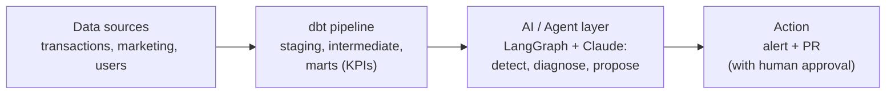
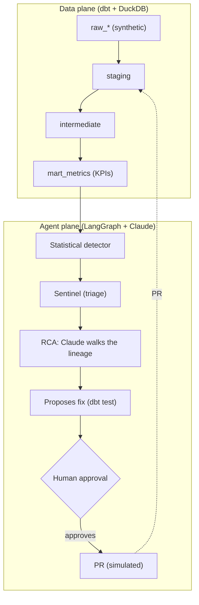

# Data Sentinel, Agentic Data Analytics Engineering

[Português](README.md) · **English**

3 a.m. on a Saturday, and a KPI falls off a cliff. Someone has to notice, figure out why, and propose the fix before it reaches the customer. This project puts AI agents on that night shift: they watch the KPIs, find the root cause in the dbt lineage, and show up with the fix. The final call always belongs to a person.

**Data monitoring run by agents (LangGraph + Claude), with engineering rigor and a production mindset.**

<p align="center">
  
</p>

> *A real `make pipeline` run (offline mode, no key): it detects the anomalies, points to the cause in the dbt lineage, and pauses for human approval before the PR. (Tool output is in Portuguese.)*

## Why it matters

A wrong KPI leads to a wrong decision. The Sentinel shortens the path between the problem happening and someone acting on it:

| | Without the Sentinel | With the Sentinel |
| --- | --- | --- |
| **Detection (MTTD)** | hours, or whenever someone notices | minutes |
| **Root cause** | manual investigation | automatic, in the dbt lineage |
| **Fix** | someone writes the test later | already suggested in the PR |

## Architecture at a glance



The company **Mar** (cashback) is fictional, with 100% synthetic data (always the last 90 days). A demonstration project on **Agentic Data Analytics Engineering**.

**Stack:** dbt · DuckDB · LangGraph · Claude (Anthropic) · Pydantic · pytest · GitHub Actions

---

## What this project shows

Four skills in a single flow:

1. **Data engineering rigor** a layered pipeline (staging, intermediate, marts), with a data contract, tests, and lineage. → [`transform/`](transform/)
2. **A well designed agent** distinct roles, tools with Pydantic-validated output, LangGraph orchestration, and brakes (steps and cost). → [`agents/`](agents/)
3. **The differentiator: the agent doing engineering** it infers schema, generates tests, detects the anomaly, investigates the cause in the lineage, and proposes the fix. That separates agentic data engineering from a BI chatbot.
4. **Production mindset (LLMOps)** evals as a CI gate, observability (tokens, cost, latency), and a human in the loop. → [`evals/`](evals/), [`observability/`](observability/)

## How it works



Two planes: the **data product** (dbt, the source of truth) and the **agent layer** that watches it. The statistics find the anomaly (a robust z-score, cheap and auditable); Claude comes in only to reason about the cause and write the fix. That way the anomaly does not depend on the model, and the LLM does engineering instead of small talk.

## Cost and efficiency (FinOps)

Running an LLM over data gets expensive fast. Three levers keep the bill down:

- **Statistical detection, not LLM:** the step that runs all the time costs zero API. The model is only called when there is an anomaly to explain.
- **The right model for each task:** the simple one (inferring a contract) goes to the cheap model (`LLM_MODEL_FAST`, e.g. Haiku); cause reasoning goes to the strong one (`LLM_MODEL_SMART`, e.g. Sonnet).
- **Ceiling and measurement:** tokens and cost in the trace, with an `AGENT_MAX_USD` ceiling that aborts if exceeded. Offline mode costs zero. Switching to a local model (Ollama) touches only the LLM client.

## The agent team

| Agent | What it does | In → Out (validated) | Model |
| --- | --- | --- | --- |
| **Profiler** | Infers a new source's contract and writes the dbt test YAML | sample → `DataContract` + `ProposedFix` | cheap |
| **Sentinel** | Filters the detector's signals and writes the alert | `AnomalySignal[]` → alert | none |
| **RCA** | Claude walks the dbt lineage and points to the guilty node, with evidence | `AnomalySignal` + lineage → `RootCauseHypothesis` | strong |
| **Orchestrator** | The LangGraph graph: detect, investigate, approve, open PR | applies the brakes | n/a |

## Results (evals)

`make evals` compares the agents against the ground truth (the planted anomalies):

| Metric (`make evals`, synthetic data) | Result |
| --- | --- |
| Detection recall | 100% |
| Root-cause accuracy (RCA) | 100% (3/3) |
| Precision | ~83 to 100%, depending on the window |
| Cost in offline mode | US$ 0.00 |

All reproducible with one command. In CI, the gate requires recall >= 99% and RCA >= 66%. Latency and cost in live mode depend on the chosen model.

## Running the project

Clone it and run in seconds. By default it stays in **offline mode** (`LLM_MODE=offline`): the whole loop, including the approval pause, runs deterministically and **without an API key**.

```bash
make setup      # install dependencies
make build      # generate synthetic data and run dbt
make pipeline   # the agent loop: detect, investigate, wait for approval, propose the fix
make evals      # measure the agents against the ground truth
make test       # unit tests
```

> `make test` includes a test that **simulates the Claude API response** and validates the tool-use parsing of `live` mode, no key required.

<details>
<summary>See the full output of <code>make pipeline</code></summary>

```text
== Sentinela de Dados · Mar | modo LLM: offline ==

[notifier:console]
🔎 *Sentinela de Dados · Mar*
approval_rate em 2026-06-11 ficou abaixo do esperado: observado=0.6862 vs baseline=0.9202 (z=-11.45, severidade=critical).
• causa provavel: `int_transactions_enriched` (confianca 60%)
• proposta: dbt_test → aguardando aprovacao humana (PR)
[notifier:console]
🔎 *Sentinela de Dados · Mar*
approval_rate em 2026-06-12 ficou abaixo do esperado: observado=0.7198 vs baseline=0.9202 (z=-9.81, severidade=critical).
• causa provavel: `int_transactions_enriched` (confianca 60%)
• proposta: dbt_test → aguardando aprovacao humana (PR)
[notifier:console]
🔎 *Sentinela de Dados · Mar*
cashback_null_rate em 2026-04-27 ficou acima do esperado: observado=0.3886 vs baseline=0 (z=6.46, severidade=critical).
• causa provavel: `stg_transactions` (confianca 60%)
• proposta: dbt_test → aguardando aprovacao humana (PR)
[notifier:console]
🔎 *Sentinela de Dados · Mar*
cashback_null_rate em 2026-04-28 ficou acima do esperado: observado=0.3317 vs baseline=0 (z=5.51, severidade=warning).
• causa provavel: `stg_transactions` (confianca 60%)
• proposta: dbt_test → aguardando aprovacao humana (PR)
[notifier:console]
🔎 *Sentinela de Dados · Mar*
cashback_null_rate em 2026-04-29 ficou acima do esperado: observado=0.2752 vs baseline=0 (z=4.57, severidade=warning).
• causa provavel: `stg_transactions` (confianca 60%)
• proposta: dbt_test → aguardando aprovacao humana (PR)
[notifier:console]
🔎 *Sentinela de Dados · Mar*
roas em 2026-05-27 ficou abaixo do esperado: observado=0.143 vs baseline=0.2971 (z=-7.1, severidade=critical).
• causa provavel: `stg_marketing` (confianca 60%)
• proposta: dbt_test → aguardando aprovacao humana (PR)
[notifier:console]
🔎 *Sentinela de Dados · Mar*
roas em 2026-05-28 ficou abaixo do esperado: observado=0.1301 vs baseline=0.2971 (z=-7.69, severidade=critical).
• causa provavel: `stg_marketing` (confianca 60%)
• proposta: dbt_test → aguardando aprovacao humana (PR)
[notifier:console]
🔎 *Sentinela de Dados · Mar*
roas em 2026-05-29 ficou abaixo do esperado: observado=0.1167 vs baseline=0.2971 (z=-8.31, severidade=critical).
• causa provavel: `stg_marketing` (confianca 60%)
• proposta: dbt_test → aguardando aprovacao humana (PR)
[notifier:console]
🔎 *Sentinela de Dados · Mar*
roas em 2026-05-30 ficou abaixo do esperado: observado=0.121 vs baseline=0.2971 (z=-8.11, severidade=critical).
• causa provavel: `stg_marketing` (confianca 60%)
• proposta: dbt_test → aguardando aprovacao humana (PR)
[notifier:console]
🔎 *Sentinela de Dados · Mar*
roas em 2026-05-31 ficou abaixo do esperado: observado=0.1218 vs baseline=0.2971 (z=-8.07, severidade=critical).
• causa provavel: `stg_marketing` (confianca 60%)
• proposta: dbt_test → aguardando aprovacao humana (PR)
[trace] sentinela: 1.1ms | 10 chamada(s) LLM | $0.0

10 anomalia(s) processada(s) (cada uma com causa raiz e correcao proposta, aguardando aprovacao).

== Perfilador: contrato + teste para a fonte raw_transactions ==

contrato inferido: 8 campos. Correcao proposta -> models/staging/_raw_transactions.yml

version: 2

models:
  - name: raw_transactions
    columns:
      - name: txn_id
        tests:
          - not_null
      - name: txn_ts
        tests:
          - not_null
      - name: user_id
        tests:
          - not_null
      - name: merchant_id
        tests:
          - not_null
      - name: channel
        tests:
          - not_null
          - accepted_values:
              values: ['direct', 'email', 'facebook_ads', 'google_ads', 'organic']
      - name: gmv
        tests:
          - not_null
      - name: cashback_amount
      - name: status
        tests:
          - not_null
          - accepted_values:
              values: ['approved', 'cancelled', 'refunded']
```

</details>

To switch on the **real Claude**: copy `.env.example` to `.env`, set `LLM_MODE=live` and `ANTHROPIC_API_KEY`. The same graph then calls the model, with cost tracked and capped by the ceiling.

## Structure

```
transform/            # data product (dbt + DuckDB): staging, intermediate, marts (KPIs)
agents/               # schemas (Pydantic), tools (lineage, warehouse, metrics), detector,
                      # profiler / sentinel / rca / orchestrator (the LangGraph graph)
evals/                # precision/recall + cause accuracy (gates the CI)
observability/        # trace of tokens, cost, and latency
data/generators/      # synthetic-data generator + the anomalies (ground truth)
.github/workflows/    # CI: lint, dbt build, tests, and evals
```

## Decisions

| Decision | Why |
| --- | --- |
| **DuckDB + dbt** | Zero infra and reproducible. In production just swap the `profiles.yml` (BigQuery, Databricks). |
| **Statistics detect, the LLM reasons** | Detection runs over every KPI all the time, so it must be cheap and auditable. The LLM steps in where it adds value: interpreting the cause and writing the fix. |
| **Two models (cheap and strong)** | A simple task does not need an expensive model; routing by difficulty cuts cost. |
| **LangGraph with a human pause** | The agent proposes, the person approves; nothing changes in production on its own. |
| **Output always in Pydantic** | The model can get the content wrong, never the format. Validate early. |
| **Synthetic data with a planted anomaly** | It provides the ground truth for evaluation and lets the repo run without private data. |
