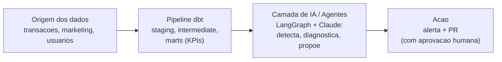
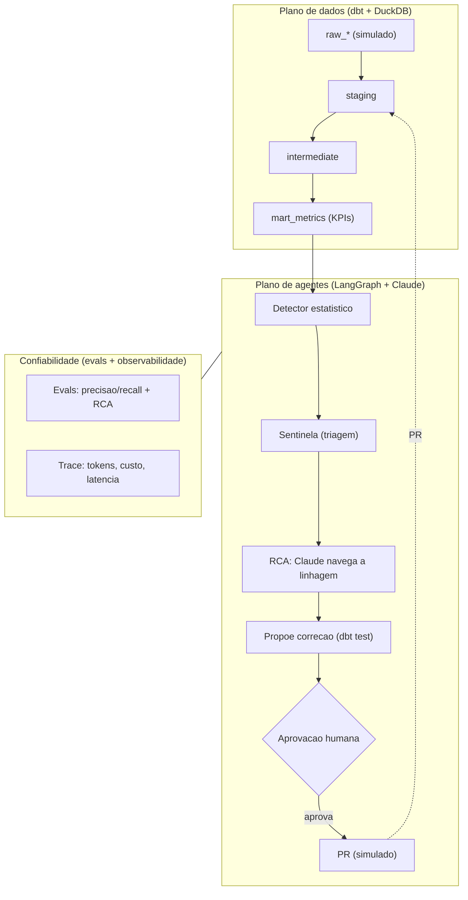

# Sentinela de Dados, Agentic Data Analytics Engineering

**Português** · [English](README.en.md)

Imagine que, às 3 da manhã de um sábado, o ROAS de uma campanha despenca. Alguém precisa perceber, entender o porquê e propor o conserto antes que isso vire prejuízo ou chegue no cliente. Este projeto coloca agentes de IA para fazer esse plantão na camada de dados: eles vigiam os KPIs, descobrem a causa raiz percorrendo a linhagem do dbt e já chegam com a correção na mão. A palavra final é sempre de uma pessoa.

Em uma frase: **monitoramento de dados feito por agentes (LangGraph + Claude), com rigor de engenharia e cabeça de produção.**

## Valor de negócio

KPI errado leva a decisão errada. O objetivo desta sentinela é encurtar o tempo entre o problema acontecer e alguém saber: sair de horas (ou do dashboard que ninguém abriu) para minutos, o famoso MTTD, tempo médio de detecção. E ela não só avisa: já entrega a causa provável e o teste do dbt que evita a reincidência, deixando a decisão de aplicar com uma pessoa. Em uma operação com muitos KPIs, isso é a diferença entre apagar incêndio e prevenir.

## Arquitetura em um olhar



<p align="center">
  
</p>

> *Execução real do `make pipeline` (modo offline, determinístico): o agente acha as anomalias, aponta onde nasceram na linhagem do dbt e para para a aprovação humana antes de abrir o PR.*

Tudo aqui roda sobre a **Mar**, uma empresa de cashback fictícia, com dados 100% simulados (sempre dos últimos 90 dias, para parecerem recentes). É um projeto de demonstração: a ideia é mostrar, na prática, o que dá para fazer em Agentic Data Analytics Engineering, sem depender de dado de ninguém.

**Stack:** dbt · DuckDB · LangGraph · Claude (Anthropic) · Pydantic · pytest · GitHub Actions

---

## O que este projeto mostra (os 4 ingredientes)

Quatro competências costuradas em um fluxo só:

1. **Rigor de engenharia de dados.** Um pipeline de verdade, da ingestão ao consumo, em camadas (staging, intermediate, marts), com contrato de dados, testes automatizados e linhagem. Sem esse chão de fábrica embaixo, o agente não tem onde pisar. → [`transform/`](transform/)
2. **Um agente bem desenhado.** Nada de prompt gigante: papéis bem definidos (perfilador, sentinela, RCA), ferramentas com saída validada por Pydantic, orquestração em LangGraph e freios de segurança (limite de passos e teto de custo). → [`agents/`](agents/)
3. **O diferencial: o agente fazendo engenharia.** Ele infere schema e gera testes, detecta a anomalia, investiga a causa raiz navegando a linhagem do dbt e propõe a correção. É isso que separa agentic data engineering de um chatbot de BI.
4. **Cabeça de produção (LLMOps).** Avaliação objetiva com dados rotulados (precisão, recall e acerto da causa raiz) travando o CI, observabilidade de tokens, custo e latência, e um humano no circuito: o agente sugere, a pessoa aprova, nada muda em produção sozinho. → [`evals/`](evals/), [`observability/`](observability/)

---

## Como funciona

São dois mundos que conversam. De um lado, o **produto de dados**: a fonte da verdade, onde cada KPI tem uma definição só. Do outro, a **camada de agentes** (LangGraph + Claude), que vigia esse produto. Em volta dos dois, a malha de confiabilidade (avaliação e observabilidade).



**Uma escolha importante: quem acha a anomalia é a estatística, não o LLM.** A detecção é um cálculo determinístico e barato (z-score robusto sobre a série de cada KPI, já descontada a sazonalidade da semana). O Claude entra depois, para a parte em que ele é imbatível: raciocinar sobre a causa e escrever a correção. Resultado: a anomalia não depende do humor do modelo, o custo fica sob controle, e o LLM faz engenharia em vez de bate-papo.

---

## Custo e eficiência (FinOps)

Rodar LLM em cima de dados fica caro rápido se a gente não tomar cuidado. Três decisões seguram a conta:

1. **A detecção é estatística, não LLM.** O passo que roda o tempo todo (varrer todas as séries de KPI) custa zero de API. O modelo só é chamado quando já existe uma anomalia para explicar, ou seja, em pouquíssimos eventos.
2. **Modelo certo para cada tarefa.** Tarefa simples, como inferir o contrato de uma fonte, vai num modelo barato e rápido (`LLM_MODEL_FAST`, por exemplo o Haiku). O raciocínio difícil de causa raiz vai num modelo forte (`LLM_MODEL_SMART`, por exemplo o Sonnet). É só trocar a variável de ambiente.
3. **Teto de custo e medição.** Cada execução contabiliza tokens e custo (aparece no trace), e existe um teto (`AGENT_MAX_USD`) que aborta a execução se estourar. O modo offline roda tudo a custo zero, para CI e testes.

O cliente de LLM é o único ponto de integração: se quiser zerar o custo de API, dá para apontar para um modelo local (por exemplo via Ollama) mexendo só ali.

---

## O time de agentes

| Agente | O que faz | Entra → Sai (validado) | Modelo |
| --- | --- | --- | --- |
| **Perfilador** | Olha uma fonte nova, deduz o contrato de dados e já escreve o YAML de testes do dbt | amostra → `DataContract` + `ProposedFix` | barato |
| **Sentinela** | Filtra os sinais do detector e redige o alerta | `AnomalySignal[]` → alerta (Slack ou console) | nenhum |
| **RCA** | O Claude percorre a linhagem do dbt e aponta o nó culpado, com evidência | `AnomalySignal` + linhagem → `RootCauseHypothesis` | forte |
| **Orquestrador** | O grafo LangGraph que conduz tudo: detectar, investigar, aprovar, abrir PR | (aplica os freios de segurança) | n/d |

As ferramentas que os agentes usam (`agents/tools/`): leitor da linhagem do dbt, consulta ao DuckDB, leitura da camada de métricas e o notificador (Slack, com console de reserva).

---

## Rodando o projeto

Clona e roda em segundos. Por padrão fica em **modo offline** (`LLM_MODE=offline`): o ciclo inteiro, incluindo o grafo e a pausa de aprovação, roda de forma determinística e **sem chave de API**. É o mesmo modo usado pelos testes e pelo CI.

```bash
make setup      # instala as dependencias
make build      # gera os dados simulados e roda o dbt (staging ate os marts, com testes)
make pipeline   # o ciclo do agente: detecta, investiga, espera aprovacao, propoe a correcao
make evals      # mede os agentes contra o gabarito (precisao, recall e acerto da causa)
make test       # testes unitarios
```

> O `make test` inclui um teste que **simula a resposta da API do Claude** e valida a leitura do tool-use no modo `live`. É a prova de que, quando o modelo responde de verdade, a estrutura é lida e validada certinho, sem precisar de chave.

<details>
<summary>Ver a saída completa do <code>make pipeline</code></summary>

```text
== Sentinela de Dados · Mar | modo LLM: offline ==

[notifier:console]
🔎 *Sentinela de Dados · Mar*
approval_rate em 2026-06-11 ficou abaixo do esperado: observado=0.6862 vs baseline=0.9202 (z=-11.45, severidade=critical).
• causa provavel: `int_transactions_enriched` (confianca 60%)
• proposta: dbt_test → aguardando aprovacao humana (PR)
[notifier:console]
🔎 *Sentinela de Dados · Mar*
approval_rate em 2026-06-12 ficou abaixo do esperado: observado=0.7198 vs baseline=0.9202 (z=-9.81, severidade=critical).
• causa provavel: `int_transactions_enriched` (confianca 60%)
• proposta: dbt_test → aguardando aprovacao humana (PR)
[notifier:console]
🔎 *Sentinela de Dados · Mar*
cashback_null_rate em 2026-04-27 ficou acima do esperado: observado=0.3886 vs baseline=0 (z=6.46, severidade=critical).
• causa provavel: `stg_transactions` (confianca 60%)
• proposta: dbt_test → aguardando aprovacao humana (PR)
[notifier:console]
🔎 *Sentinela de Dados · Mar*
cashback_null_rate em 2026-04-28 ficou acima do esperado: observado=0.3317 vs baseline=0 (z=5.51, severidade=warning).
• causa provavel: `stg_transactions` (confianca 60%)
• proposta: dbt_test → aguardando aprovacao humana (PR)
[notifier:console]
🔎 *Sentinela de Dados · Mar*
cashback_null_rate em 2026-04-29 ficou acima do esperado: observado=0.2752 vs baseline=0 (z=4.57, severidade=warning).
• causa provavel: `stg_transactions` (confianca 60%)
• proposta: dbt_test → aguardando aprovacao humana (PR)
[notifier:console]
🔎 *Sentinela de Dados · Mar*
roas em 2026-05-27 ficou abaixo do esperado: observado=0.143 vs baseline=0.2971 (z=-7.1, severidade=critical).
• causa provavel: `stg_marketing` (confianca 60%)
• proposta: dbt_test → aguardando aprovacao humana (PR)
[notifier:console]
🔎 *Sentinela de Dados · Mar*
roas em 2026-05-28 ficou abaixo do esperado: observado=0.1301 vs baseline=0.2971 (z=-7.69, severidade=critical).
• causa provavel: `stg_marketing` (confianca 60%)
• proposta: dbt_test → aguardando aprovacao humana (PR)
[notifier:console]
🔎 *Sentinela de Dados · Mar*
roas em 2026-05-29 ficou abaixo do esperado: observado=0.1167 vs baseline=0.2971 (z=-8.31, severidade=critical).
• causa provavel: `stg_marketing` (confianca 60%)
• proposta: dbt_test → aguardando aprovacao humana (PR)
[notifier:console]
🔎 *Sentinela de Dados · Mar*
roas em 2026-05-30 ficou abaixo do esperado: observado=0.121 vs baseline=0.2971 (z=-8.11, severidade=critical).
• causa provavel: `stg_marketing` (confianca 60%)
• proposta: dbt_test → aguardando aprovacao humana (PR)
[notifier:console]
🔎 *Sentinela de Dados · Mar*
roas em 2026-05-31 ficou abaixo do esperado: observado=0.1218 vs baseline=0.2971 (z=-8.07, severidade=critical).
• causa provavel: `stg_marketing` (confianca 60%)
• proposta: dbt_test → aguardando aprovacao humana (PR)
[trace] sentinela: 1.2ms | 10 chamada(s) LLM | $0.0

10 anomalia(s) processada(s) (cada uma com causa raiz e correcao proposta, aguardando aprovacao).

== Perfilador: contrato + teste para a fonte raw_transactions ==

contrato inferido: 8 campos. Correcao proposta -> models/staging/_raw_transactions.yml

version: 2

models:
  - name: raw_transactions
    columns:
      - name: txn_id
        tests:
          - not_null
      - name: txn_ts
        tests:
          - not_null
      - name: user_id
        tests:
          - not_null
      - name: merchant_id
        tests:
          - not_null
      - name: channel
        tests:
          - not_null
          - accepted_values:
              values: ['direct', 'email', 'facebook_ads', 'google_ads', 'organic']
      - name: gmv
        tests:
          - not_null
      - name: cashback_amount
      - name: status
        tests:
          - not_null
          - accepted_values:
              values: ['approved', 'cancelled', 'refunded']
```

</details>

Quando quiser ligar o **Claude de verdade**: copie o `.env.example` para `.env`, defina `LLM_MODE=live` e a `ANTHROPIC_API_KEY`. O mesmo grafo passa a chamar o modelo (com tool-use na linhagem e saída estruturada), e o custo já entra contabilizado e limitado pelo teto que você configurar.

---

## Estrutura do repositório

```
transform/            # ingrediente 1: o produto de dados (dbt + DuckDB)
  models/staging      #   limpeza 1:1 + testes
  models/intermediate #   regras de negocio (status de receita, sinais de qualidade)
  models/marts        #   mart_metrics: a camada de KPIs (com contrato)
agents/               # ingredientes 2 e 3
  common/             #   schemas (Pydantic), settings, cliente Claude (tool-use + freios)
  tools/              #   linhagem do dbt, warehouse, metricas, notificador
  detectors/          #   deteccao estatistica (z-score robusto, sem sazonalidade)
  profiler / sentinel / rca / orchestrator (o grafo LangGraph)
evals/                # ingrediente 4: precisao/recall + acerto da causa (trava o CI)
observability/        # ingrediente 4: trace de tokens, custo e latencia
data/generators/      # o gerador dos dados simulados da Mar + as anomalias (gabarito)
.github/workflows/    # CI: lint, dbt build, testes e evals
```

---

## Decisões (e por que tomei cada uma)

| Decisão | Por quê |
| --- | --- |
| **DuckDB + dbt** | Zero infra e 100% reproduzível: qualquer pessoa clona e roda na hora. Os modelos não dependem do banco, então em produção é só trocar o `profiles.yml` (BigQuery, Databricks na AWS). |
| **Quem detecta é a estatística** | A anomalia precisa ser auditável e barata. LLM custa e pode inventar, então deixo para ele só o raciocínio da causa e a redação do conserto. |
| **Dois modelos (barato e forte)** | Tarefa simples não precisa de modelo caro. Roteirizar por dificuldade derruba o custo sem perder qualidade onde importa. |
| **LangGraph com pausa para o humano** | Uma pausa nativa antes de abrir o PR, com o estado salvo: o agente propõe, a pessoa aprova. É o jeito de produção de fazer "o agente sugere, o humano decide". |
| **Saída do agente sempre em Pydantic** | O modelo pode errar o conteúdo, mas nunca o formato. Validar cedo evita lixo silencioso lá na frente. |
| **Modo offline determinístico** | Testes e CI exercitam o grafo inteiro sem chave e sem custo. Esse dublê do modelo deixa a avaliação reproduzível a cada mudança. |
| **Dados sintéticos com anomalia plantada** | Dão o gabarito (sem ele não existe avaliação objetiva) e deixam o repositório rodar sem depender de dado privado. |

---

## Próximos passos

1. **Linhagem coluna a coluna** (sqlglot): chegar em "o `roas` depende de `stg_marketing.spend`".
2. **Sazonalidade mais esperta** (STL) no detector, para derrubar ainda mais o falso positivo.
3. **Mandar os traces** para o Langfuse ou OpenTelemetry.
4. **Conserto supervisionado**: o `open_pr` abrindo um PR de verdade pela API do GitHub, com revisão obrigatória.
5. **Modelo local opcional** (Ollama) para tarefas simples, zerando o custo de API.
6. **Avaliação com vários modelos e prompts**, comparando custo e acerto.
