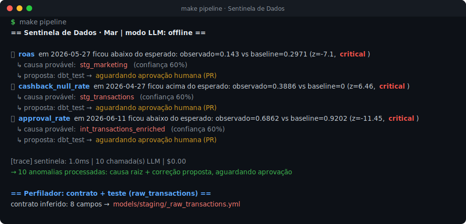
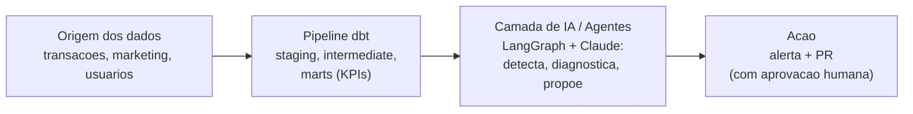
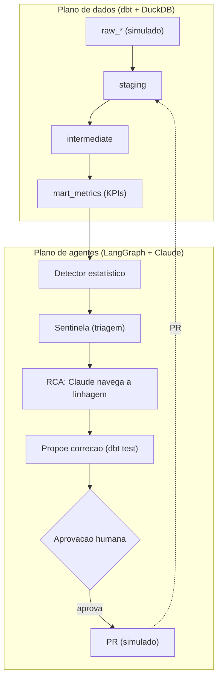

# Sentinela de Dados, Agentic Data Analytics Engineering

**Português** · [English](README.en.md)

Às 3 da manhã de um sábado, um KPI despenca. Alguém precisa perceber, entender o porquê e propor o conserto antes que chegue no cliente. Este projeto põe agentes de IA nesse plantão: eles vigiam os KPIs, acham a causa raiz na linhagem do dbt e já chegam com a correção. A palavra final é sempre de uma pessoa.

**Monitoramento de dados feito por agentes (LangGraph + Claude), com rigor de engenharia e cabeça de produção.**

<p align="center">
  
</p>

> *Execução real do `make pipeline` (modo offline, sem chave): detecta as anomalias, aponta a causa na linhagem do dbt e para para a aprovação humana antes do PR.*

## Por que importa

KPI errado leva a decisão errada. O Sentinela encurta o caminho entre o problema acontecer e alguém agir:

| | Sem o Sentinela | Com o Sentinela |
| --- | --- | --- |
| **Detecção (MTTD)** | horas, ou quando alguém nota | minutos |
| **Causa raiz** | investigação manual | automática, na linhagem do dbt |
| **Correção** | alguém escreve o teste depois | já vem sugerida no PR |

## Arquitetura em um olhar



Empresa **Mar** (cashback) fictícia, dados 100% simulados (sempre dos últimos 90 dias). Projeto de demonstração de **Agentic Data Analytics Engineering**.

**Stack:** dbt · DuckDB · LangGraph · Claude (Anthropic) · Pydantic · pytest · GitHub Actions

---

## O que este projeto mostra

Quatro competências em um fluxo só:

1. **Rigor de engenharia de dados** pipeline em camadas (staging, intermediate, marts), com contrato de dados, testes e linhagem. → [`transform/`](transform/)
2. **Agente bem desenhado** papéis distintos, ferramentas com saída validada por Pydantic, orquestração em LangGraph e freios (passos e custo). → [`agents/`](agents/)
3. **O diferencial: o agente fazendo engenharia** infere schema, gera testes, detecta anomalia, investiga a causa na linhagem e propõe a correção. Isso separa agentic data engineering de um chatbot de BI.
4. **Cabeça de produção (LLMOps)** evals como gate no CI, observabilidade (tokens, custo, latência) e humano no circuito. → [`evals/`](evals/), [`observability/`](observability/)

## Como funciona



Dois planos: o **produto de dados** (dbt, a fonte da verdade) e a **camada de agentes** que o vigia. Quem acha a anomalia é a estatística (z-score robusto, barato e auditável); o Claude entra só pra raciocinar a causa e escrever a correção. Assim a anomalia não depende do modelo, e o LLM faz engenharia em vez de bate-papo.

## Custo e eficiência (FinOps)

Rodar LLM sobre dados fica caro rápido. Três alavancas seguram a conta:

- **Detecção estatística, não LLM:** o passo que roda o tempo todo custa zero de API. O modelo só é chamado quando há anomalia para explicar.
- **Modelo certo para cada tarefa:** o simples (inferir contrato) vai no barato (`LLM_MODEL_FAST`, ex. Haiku); o raciocínio de causa vai no forte (`LLM_MODEL_SMART`, ex. Sonnet).
- **Teto e medição:** tokens e custo no trace, com teto `AGENT_MAX_USD` que aborta se estourar. No modo offline, custo zero. Trocar por um modelo local (Ollama) mexe só no cliente de LLM.

## O time de agentes

| Agente | O que faz | Entra → Sai (validado) | Modelo |
| --- | --- | --- | --- |
| **Perfilador** | Deduz o contrato de uma fonte nova e escreve o YAML de testes do dbt | amostra → `DataContract` + `ProposedFix` | barato |
| **Sentinela** | Filtra os sinais do detector e redige o alerta | `AnomalySignal[]` → alerta | nenhum |
| **RCA** | O Claude percorre a linhagem do dbt e aponta o nó culpado, com evidência | `AnomalySignal` + linhagem → `RootCauseHypothesis` | forte |
| **Orquestrador** | O grafo LangGraph: detectar, investigar, aprovar, abrir PR | aplica os freios | n/d |

## Resultados (evals)

O `make evals` compara os agentes com o gabarito (as anomalias plantadas):

| Métrica (`make evals`, dados sintéticos) | Resultado |
| --- | --- |
| Recall da detecção | 100% |
| Acerto da causa raiz (RCA) | 100% (3/3) |
| Precisão | ~83 a 100%, conforme a janela |
| Custo no modo offline | US$ 0,00 |

Tudo reproduzível com um comando. No CI, o gate exige recall ≥ 99% e RCA ≥ 66%. Latência e custo no modo live dependem do modelo escolhido.

## Rodando o projeto

Clona e roda em segundos. Por padrão fica em **modo offline** (`LLM_MODE=offline`): o ciclo inteiro, incluindo a pausa de aprovação, roda de forma determinística e **sem chave de API**.

```bash
make setup      # instala as dependencias
make build      # gera os dados simulados e roda o dbt
make pipeline   # o ciclo do agente: detecta, investiga, espera aprovacao, propoe a correcao
make evals      # mede os agentes contra o gabarito
make test       # testes unitarios
```

> O `make test` inclui um teste que **simula a resposta da API do Claude** e valida a leitura do tool-use do modo `live`, sem precisar de chave.

<details>
<summary>Ver a saída completa do <code>make pipeline</code></summary>

```text
== Sentinela de Dados · Mar | modo LLM: offline ==

[notifier:console]
🔎 *Sentinela de Dados · Mar*
approval_rate em 2026-06-11 ficou abaixo do esperado: observado=0.6862 vs baseline=0.9202 (z=-11.45, severidade=critical).
• causa provavel: `int_transactions_enriched` (confianca 60%)
• proposta: dbt_test → aguardando aprovacao humana (PR)
[notifier:console]
🔎 *Sentinela de Dados · Mar*
approval_rate em 2026-06-12 ficou abaixo do esperado: observado=0.7198 vs baseline=0.9202 (z=-9.81, severidade=critical).
• causa provavel: `int_transactions_enriched` (confianca 60%)
• proposta: dbt_test → aguardando aprovacao humana (PR)
[notifier:console]
🔎 *Sentinela de Dados · Mar*
cashback_null_rate em 2026-04-27 ficou acima do esperado: observado=0.3886 vs baseline=0 (z=6.46, severidade=critical).
• causa provavel: `stg_transactions` (confianca 60%)
• proposta: dbt_test → aguardando aprovacao humana (PR)
[notifier:console]
🔎 *Sentinela de Dados · Mar*
cashback_null_rate em 2026-04-28 ficou acima do esperado: observado=0.3317 vs baseline=0 (z=5.51, severidade=warning).
• causa provavel: `stg_transactions` (confianca 60%)
• proposta: dbt_test → aguardando aprovacao humana (PR)
[notifier:console]
🔎 *Sentinela de Dados · Mar*
cashback_null_rate em 2026-04-29 ficou acima do esperado: observado=0.2752 vs baseline=0 (z=4.57, severidade=warning).
• causa provavel: `stg_transactions` (confianca 60%)
• proposta: dbt_test → aguardando aprovacao humana (PR)
[notifier:console]
🔎 *Sentinela de Dados · Mar*
roas em 2026-05-27 ficou abaixo do esperado: observado=0.143 vs baseline=0.2971 (z=-7.1, severidade=critical).
• causa provavel: `stg_marketing` (confianca 60%)
• proposta: dbt_test → aguardando aprovacao humana (PR)
[notifier:console]
🔎 *Sentinela de Dados · Mar*
roas em 2026-05-28 ficou abaixo do esperado: observado=0.1301 vs baseline=0.2971 (z=-7.69, severidade=critical).
• causa provavel: `stg_marketing` (confianca 60%)
• proposta: dbt_test → aguardando aprovacao humana (PR)
[notifier:console]
🔎 *Sentinela de Dados · Mar*
roas em 2026-05-29 ficou abaixo do esperado: observado=0.1167 vs baseline=0.2971 (z=-8.31, severidade=critical).
• causa provavel: `stg_marketing` (confianca 60%)
• proposta: dbt_test → aguardando aprovacao humana (PR)
[notifier:console]
🔎 *Sentinela de Dados · Mar*
roas em 2026-05-30 ficou abaixo do esperado: observado=0.121 vs baseline=0.2971 (z=-8.11, severidade=critical).
• causa provavel: `stg_marketing` (confianca 60%)
• proposta: dbt_test → aguardando aprovacao humana (PR)
[notifier:console]
🔎 *Sentinela de Dados · Mar*
roas em 2026-05-31 ficou abaixo do esperado: observado=0.1218 vs baseline=0.2971 (z=-8.07, severidade=critical).
• causa provavel: `stg_marketing` (confianca 60%)
• proposta: dbt_test → aguardando aprovacao humana (PR)
[trace] sentinela: 1.1ms | 10 chamada(s) LLM | $0.0

10 anomalia(s) processada(s) (cada uma com causa raiz e correcao proposta, aguardando aprovacao).

== Perfilador: contrato + teste para a fonte raw_transactions ==

contrato inferido: 8 campos. Correcao proposta -> models/staging/_raw_transactions.yml

version: 2

models:
  - name: raw_transactions
    columns:
      - name: txn_id
        tests:
          - not_null
      - name: txn_ts
        tests:
          - not_null
      - name: user_id
        tests:
          - not_null
      - name: merchant_id
        tests:
          - not_null
      - name: channel
        tests:
          - not_null
          - accepted_values:
              values: ['direct', 'email', 'facebook_ads', 'google_ads', 'organic']
      - name: gmv
        tests:
          - not_null
      - name: cashback_amount
      - name: status
        tests:
          - not_null
          - accepted_values:
              values: ['approved', 'cancelled', 'refunded']
```

</details>

Para ligar o **Claude de verdade**: copie o `.env.example` para `.env`, defina `LLM_MODE=live` e a `ANTHROPIC_API_KEY`. O mesmo grafo passa a chamar o modelo, com o custo contabilizado e limitado pelo teto.

## Estrutura

```
transform/            # produto de dados (dbt + DuckDB): staging, intermediate, marts (KPIs)
agents/               # schemas (Pydantic), tools (linhagem, warehouse, metricas), detector,
                      # profiler / sentinel / rca / orchestrator (o grafo LangGraph)
evals/                # precisao/recall + acerto da causa (trava o CI)
observability/        # trace de tokens, custo e latencia
data/generators/      # gerador dos dados simulados + as anomalias (gabarito)
.github/workflows/    # CI: lint, dbt build, testes e evals
```

## Decisões

| Decisão | Por quê |
| --- | --- |
| **DuckDB + dbt** | Zero infra e reproduzível. Em produção é só trocar o `profiles.yml` (BigQuery, Databricks). |
| **Estatística detecta, LLM raciocina** | A anomalia precisa ser auditável e barata; o LLM custa e pode inventar. |
| **Dois modelos (barato e forte)** | Tarefa simples não precisa de modelo caro; rotear por dificuldade derruba o custo. |
| **LangGraph com pausa humana** | O agente propõe, a pessoa aprova; nada muda em produção sozinho. |
| **Saída sempre em Pydantic** | O modelo pode errar o conteúdo, nunca o formato. Valida cedo. |
| **Dados sintéticos com anomalia plantada** | Dão o gabarito para a avaliação e deixam o repo rodar sem dado privado. |

## Próximos passos

1. **Linhagem coluna a coluna** (sqlglot): "o `roas` depende de `stg_marketing.spend`".
2. **Sazonalidade mais esperta** (STL) no detector.
3. **Traces** para Langfuse ou OpenTelemetry.
4. **Conserto supervisionado**: `open_pr` abrindo um PR real via API do GitHub.
5. **Modelo local opcional** (Ollama) para tarefas simples.
